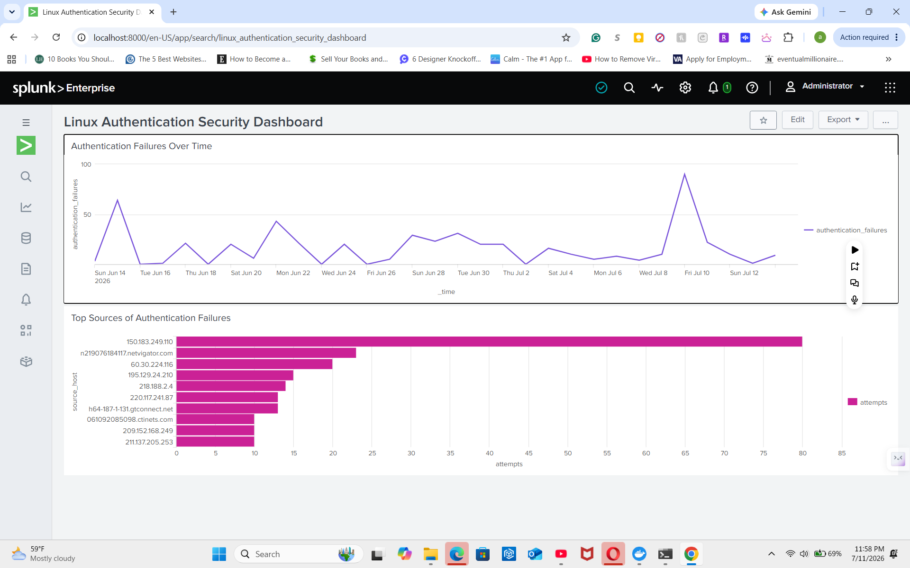
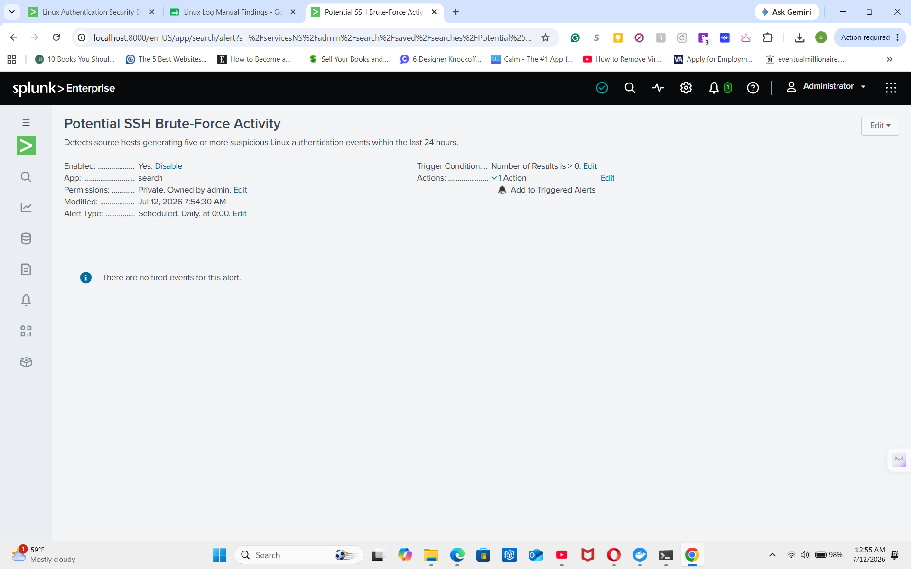

# Linux Log Analysis, Python Automation, and Splunk Visualization

## Project Overview

This project demonstrates a Security Operations Center workflow by manually analyzing Linux authentication logs, automating suspicious-event detection with Python, and using Splunk Enterprise to investigate and visualize possible brute-force activity.

**Workflow:** Monitor → Detect → Analyze → Visualize → Alert → Report

## Tools Used

- Visual Studio Code
- Python
- Google Sheets
- Splunk Enterprise
- Docker Desktop
- Windows Subsystem for Linux
- LogHub Linux log dataset

## Manual Log Analysis

I manually reviewed Linux authentication logs and documented suspicious events, including:

- Authentication failures
- Unknown-user attempts
- Repeated login attempts
- Attempts targeting the root account
- Abnormal process activity

## Python Automation

I created `log_analysis.py` to:

- Read the Linux log file
- Analyze lines 200–500
- Detect suspicious authentication activity
- Classify suspicious events
- Export results to `suspicious_logs.csv`

The script identified **148 suspicious entries**.

## Splunk Investigation

I uploaded the Linux log dataset into Splunk Enterprise and used SPL searches to investigate suspicious authentication activity.

### Key Findings

- **Total Linux events:** 1,294
- **Suspicious authentication events:** 512
- **Source hosts identified:** 39
- **Most active source:** 150.183.249.110
- **Attempts from the most active source:** 80

## Splunk Dashboard

The dashboard includes:

1. Authentication Failures Over Time
2. Top Sources of Authentication Failures

## Splunk Alert

I created a scheduled alert named:

**Potential SSH Brute-Force Activity**

The alert detects source hosts generating five or more suspicious authentication events within the previous 24 hours.

## Recommended Security Actions

- Review successful logins following failed attempts
- Disable direct root SSH login
- Require SSH key authentication
- Implement rate limiting or account lockout
- Block confirmed malicious sources
- Continue monitoring authentication logs

## Skills Demonstrated

- Linux log analysis
- Python scripting
- Security automation
- Splunk log ingestion
- SPL searching
- Field extraction with `rex`
- Statistical analysis with `stats`
- Dashboard creation
- Brute-force detection
- Alert configuration
- SOC reporting

## Project Files

- `Linux_2k.log`
- `log_analysis.py`
- `suspicious_logs.csv`
- `Linux Log Manual Findings.xlsx`
- `Linux Log Analysis Final Findings.pdf`
- `Screenshots/`

## Conclusion

This project demonstrated how manual investigation, Python automation, and SIEM analysis can work together in a SOC workflow.